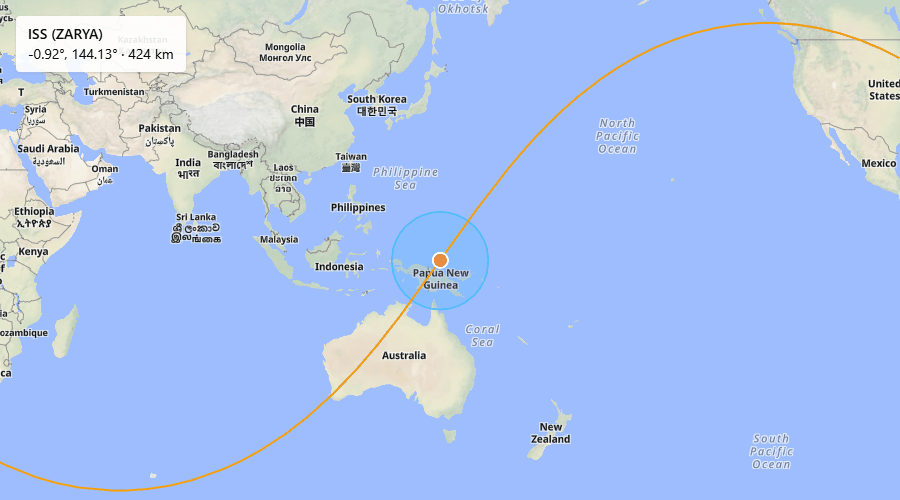
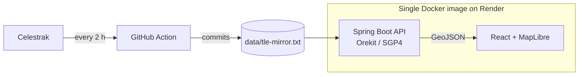

# Ground Station Dashboard



> 🚧 **Work in progress.** Building this in 4 incremental releases (Sep–Dec 2026), each one deployed before the next one starts. v0.1 and v0.2 are live; see the [Roadmap](#roadmap) below for current status.

**Live demo:** https://ground-station-dashboard-9tc8.onrender.com/
(free tier: the first request may take ~50 s while the service wakes up)

A satellite tracking system built from scratch: given a satellite's orbital data (TLE), it computes where the satellite is right now, draws its ground track and visibility footprint on an interactive map, and — in the upcoming releases — predicts passes over a ground station and visualizes the Doppler shift of its radio signal.

## Why this project

This project is part of my path toward the aerospace industry (GNC / orbital mechanics). Rather than using a quick prototyping library, it's built on **Orekit** — the orbital mechanics library used in ESA-supplier and CNES contexts — to work with the same tools and reference frames used in the industry.

## Features

- Live satellite position (latitude, longitude, altitude, speed), propagated with SGP4 via Orekit
- Ground track covering the last and next 30 minutes, split at the antimeridian so lines never cross the map
- Visibility footprint for a configurable minimum elevation, including footprints that enclose a pole
- Satellite selector (ISS, NOAA-15/18/19, NanoSatC-BR1) with smooth per-second movement computed in the browser, without polling the API
- Consistent JSON error responses (`{"error": "..."}`) for invalid or unknown requests

## Tech stack

| Layer | Technology |
|---|---|
| Backend | Java 21, Spring Boot 4, Orekit 13.1.8, Caffeine (cache) |
| Frontend | React, TypeScript, Vite, Tailwind, MapLibre GL, uPlot |
| Data | [Celestrak](https://celestrak.org/) (TLE/GP data), [SatNOGS DB & Network](https://db.satnogs.org/) |
| Infra | Docker, GitHub Actions, Render |
| Validation | JUnit 5, cross-checked against `python-sgp4` |

## Roadmap

Each version is independently deployable and validated before the next one starts.

- [x] **v0.1 — The satellite exists** *(Sep 2026)*
  REST API that returns a satellite's current geodetic position (lat/lon/altitude) from its NORAD ID, propagated with SGP4 via Orekit.
- [x] **v0.2 — Where it passes** *(Oct 2026)*
  Ground track and visibility footprint rendered on an interactive map (React + MapLibre), with a satellite selector, served together with the API as a single deploy.
- [ ] **v0.3 — When I can see it** *(Nov 2026)*
  Pass predictions (AOS/LOS, max elevation) for a user-defined ground station, with a polar plot.
- [ ] **v0.4 — Radio** *(Dec 2026)*
  Known transmitters (SatNOGS DB), Doppler curve per pass, and real observations from the SatNOGS Network.

## How it works



1. A GitHub Action refreshes `data/tle-mirror.txt` every 2 hours (see the [Architecture note](#architecture-note)).
2. The Spring Boot API propagates the orbit with Orekit and returns the results as GeoJSON.
3. The React frontend draws the footprint, the ground track and the satellite as MapLibre layers. It fetches the track every 5 minutes and the footprint every 10 seconds, and moves the marker along the track once per second by interpolation.
4. The frontend is built inside the Docker image and served by Spring Boot as static files, so the page and the API share one origin (no CORS) and the whole app is a single deploy.

## API

| Endpoint | Description |
| --- | --- |
| `GET /api` | API index with the available endpoints |
| `GET /api/satellites/{noradId}/position` | Current position, altitude and speed |
| `GET /api/satellites/{noradId}/groundtrack?spanSeconds=3600&stepSeconds=30` | Ground track as a GeoJSON `MultiLineString`, centered on the current time |
| `GET /api/satellites/{noradId}/footprint?minElevationDeg=10` | Visibility area as a GeoJSON `Polygon` |

Available satellites: ISS (`25544`), NOAA-15 (`25338`), NOAA-18 (`28654`), NOAA-19 (`33591`) and NanoSatC-BR1 (`40024`).

Example response of `/api/satellites/25544/position`:

```json
{
  "noradId": 25544,
  "name": "ISS (ZARYA)",
  "timestamp": "2026-10-06T18:43:13.647354500Z",
  "latitude": -36.21878306134803,
  "longitude": 136.3791666664875,
  "altitudeKm": 431.05572834784476,
  "velocityKmS": 7.349855011469806,
  "tleEpoch": "2026-10-06T00:20:47.861Z"
}
```

Errors are always JSON, for example `404` for an unknown satellite and `503` when the TLE source is unavailable:

```json
{ "error": "..." }
```

## Reference frames

Getting from "SGP4 output" to "a dot on a map" isn't trivial — it involves three coordinate systems:

- **TEME** — inertial frame, what SGP4 returns directly (does *not* rotate with Earth)
- **ITRF** (ECEF) — Earth-fixed frame, where map coordinates live
- **Geodetic** — latitude/longitude/altitude over the WGS84 ellipsoid

Orekit handles the full transformation chain between them.

## Validation

Propagation is cross-validated against [`python-sgp4`](https://pypi.org/project/sgp4/), an independent SGP4 implementation.

For ISS (ZARYA), NORAD 25544, propagated to `2026-09-19T12:00:00Z`: **0.7245617773954982 m** deviation in the TEME frame.

Reference script: `tools/reference.py`. Comparison test: `PropagationValidationTest`.

## Known limitations

- Footprints that enclose a pole (typical for the polar NOAA satellites) are closed along latitude ±90°. Web Mercator clips the map near ±85°, so the polar cap is drawn up to the edge of the map.
- Footprint longitudes may go beyond ±180° near the antimeridian: MapLibre repeats the polygon across the world copies. The ground track, in contrast, is split at ±180°.
- The footprint is refreshed every 10 s while the marker moves every second, so the marker can drift slightly from the circle's center. Web Mercator also shifts the circle's visual center at high latitudes.
- Positions are only as accurate as the latest TLE (refreshed every 2 hours).
- Only five satellites are available.
- On the free hosting tier the service sleeps when idle, so the first request can take around 50 seconds.

## Data sources & attribution

- Orbital elements: [Celestrak](https://celestrak.org/) — GP/TLE data, mirrored via a scheduled GitHub Action (see the [Architecture note](#architecture-note)), not queried per-request
- Transmitter and observation data: [SatNOGS DB](https://db.satnogs.org/) / [SatNOGS Network](https://network.satnogs.org/)
- Map tiles: [OpenFreeMap](https://openfreemap.org/), © [OpenMapTiles](https://openmaptiles.org/), data © [OpenStreetMap](https://www.openstreetmap.org/copyright) contributors

## Running locally

### With Docker (matches production)

```bash
git clone https://github.com/RaulRezende09/ground-station-dashboard.git
cd ground-station-dashboard
docker build -t ground-station-dashboard .
docker run -p 8080:8080 ground-station-dashboard
```

Open `http://localhost:8080` for the map. The API is available under `http://localhost:8080/api`.

### Without Docker

Requires JDK 21, Node.js 20.19+ (or 22+), and the [Orekit reference data](https://gitlab.orekit.org/orekit/orekit-data) extracted into an `orekit-data/` folder at the project root.

```bash
git clone https://github.com/RaulRezende09/ground-station-dashboard.git
cd ground-station-dashboard

# Terminal 1 - API (http://localhost:8080)
./mvnw spring-boot:run

# Terminal 2 - frontend with hot reload (http://localhost:5173)
cd web
npm install
npm run dev
```

In development, Vite proxies `/api` to the Spring Boot API, so the frontend can call it without CORS configuration.

### Try it

```bash
curl http://localhost:8080/api/satellites/25544/position
```

### Tests

```bash
./mvnw test
```

## Architecture note

Satellite data is fetched from a small TLE mirror (`data/tle-mirror.txt`), refreshed every 2 hours by a scheduled GitHub Action, rather than calling Celestrak directly from the deployed service. This was a deliberate fix: Celestrak blocks outbound traffic from some free-tier cloud IP ranges (Render's included), and GitHub Actions runners aren't affected. The mirror currently covers ISS, NOAA-15/18/19, and NanoSatC-BR1 — the same set offered by the satellite selector.

## License

MIT
 
